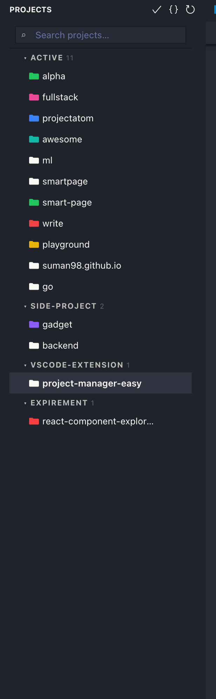
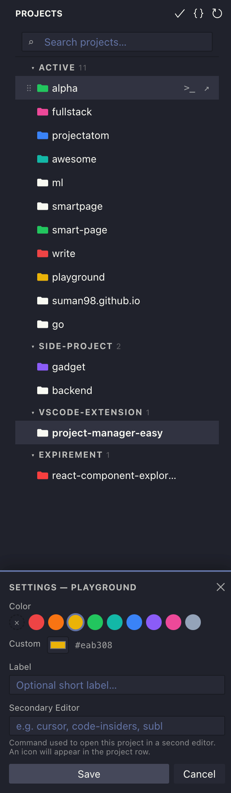

# Project Manager Easy

A VS Code extension for managing and switching between workspace projects from the sidebar.

## Features

- **Sidebar panel** — browse all projects grouped by organization
- **Live search** — filter projects as you type
- **Organizations** — group projects into named categories; drag projects onto an org header to move them
- **Drag to reorder** — grab the handle on the left of any project and drag to change order
- **Project color** — assign a color; the folder icon reflects it
- **Label badge** — short tag displayed inline next to the project name
- **Terminal button** — open the project root in a new integrated terminal
- **Secondary editor** — configure a shell command (e.g. a Zsh function) to open the project in another tool; runs via an interactive shell so `.zshrc` functions are available
- **Context menu** — right-click any project to rename, move, reveal in Finder, copy path, or remove
- **Active project highlight** — the currently open workspace is visually marked

## Usage

### Add a project

Open a workspace, then click the **+** icon in the Project Manager panel title bar (or run `Project Manager: Add Current Workspace` from the command palette).

### Switch projects

Click any project in the list. Use `projectManager.openInNewWindow` to control whether it opens in the current window or a new one.

### Organizations

When adding or moving a project, pick an existing org, create a new one, or choose "No Organization". Drag a project row onto an org group header to move it there.

### Project settings

Right-click a project → **Settings** to configure:

| Setting | Description |
|---|---|
| Color | Hex or CSS color applied to the folder icon |
| Label | Short badge shown next to the project name |
| Secondary Editor | Shell command to open the project (e.g. `cursor`, `subl`, or a Zsh function) |

### Keyboard / command palette

| Command | Description |
|---|---|
| `Project Manager: Add Current Workspace` | Add the open folder as a project |
| `Project Manager: Open Project` | Quick-pick switcher |
| `Project Manager: Refresh` | Reload projects from disk |

## Configuration

| Setting | Default | Description |
|---|---|---|
| `projectManager.file` | `~/.vscode-project-manager/projects.json` | Path to the projects JSON file |
| `projectManager.openInNewWindow` | `true` | Open projects in a new VS Code window |

The JSON file can be edited directly; the panel refreshes automatically on external changes.

## Requirements

VS Code 1.85 or later.

